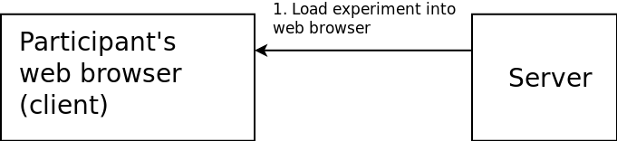
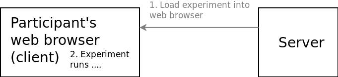
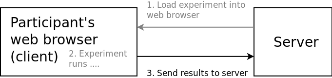
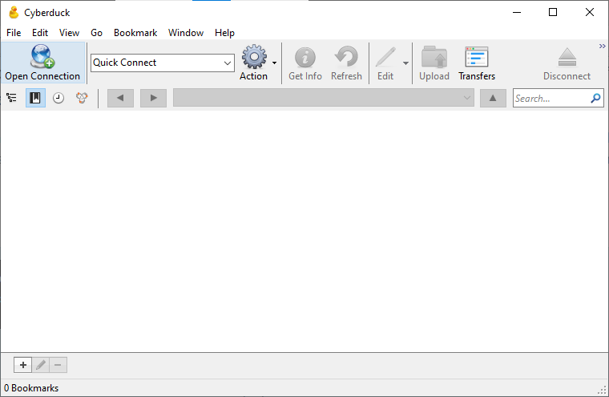
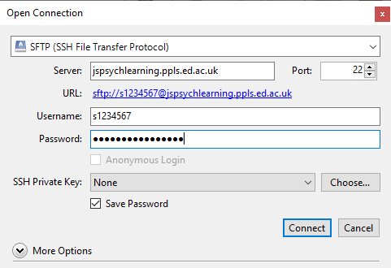
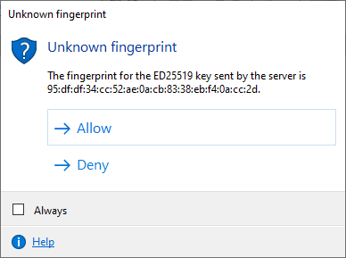
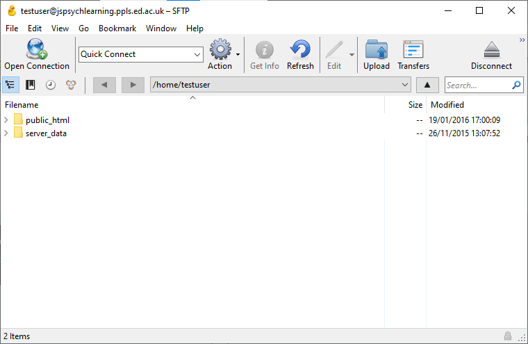
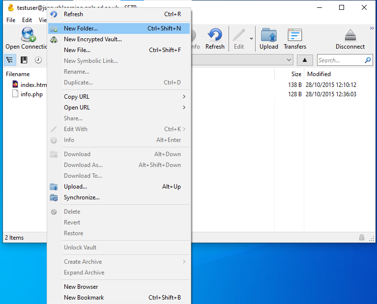
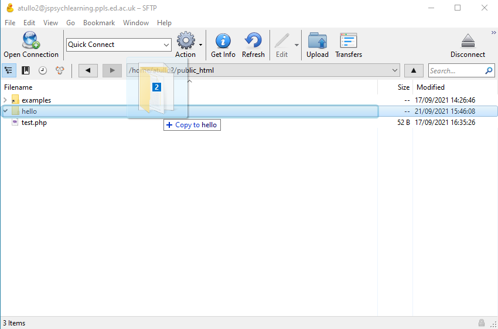

An introduction to jsPsych
==========================

jsPsych is a JavaScript framework that makes it easier to construct
presentation experiments.

A typical jsPsych experiment will follow a sequence something like this:

1. First, the experiment is loaded from the server onto the participant's
web browser (client). This is just like loading any other web page, so everything
you saw in the last section about the network, web pages, HTML, CSS and so on
applies here.

|

|

2. Now the experiment runs. This can happen entirely within the participant's web
browser -- it may not need to talk to the server at all. (It might though, for
example to load images).

|

|

3. Finally, the experiment sends the results from the experiment back to the
server.

|

". Another arrow connects the two, left to right, labelled "3. Send results to server"

|

First experiment
----------------

The following tutorial is copied from `the jsPsych website <https://www.jspsych.org/7.3/tutorials/hello-world>`_ as permitted by its license [#license]_ .

Step 1: Create an HTML file
...........................

Open your text editor (Visual Studio Code, if you took our suggestion in the Introduction).
To create a new file, use "File → Save As ....".
Choose a folder to work in and give the filename ``experiment.html``.

There's some basic code that (nearly) all HTML documents have in common. Here's a typical bare-bones HTML document.

.. code:: html

    <!DOCTYPE html>
    <html>
    <head>
        <title>My experiment</title>
    </head>
    <body></body>
    </html>

Add the above code to the ``experiment.html`` file and save it. If you open the file in a web browser, you should see a blank page and the title of the page will be 'My experiment'. (To open ``experiment.html``, try double-clicking on it in your files. If that doesn't work, right-click on it, choose "Open with ...." and choose a web browser.)

Step 2: Load the jsPsych library
................................

To use jsPsych, add a 
    </head>
    <body></body>
    </html>

Note that the URL for the jsPsych library includes the version number, which ensures that the behavior of your experiment won't change with any future updates to jsPsych.

You may also want to import the jsPsych stylesheet, which applies a basic set of visual styles to the experiment. This requires adding a <link> tag to the <head> section of the document.

.. code:: html

    <!DOCTYPE html>
    <html>
    <head>
        <title>My experiment</title>
        
        <link href="https://unpkg.com/jspsych@7.3.3/css/jspsych.css" rel="stylesheet" type="text/css" />
    </head>
    <body></body>
    </html>

Step 3: Create a script element and initialize jsPsych
......................................................

To add JavaScript code directly to the webpage we need to add a pair of 
        <link href="https://unpkg.com/jspsych@7.3.3/css/jspsych.css" rel="stylesheet" type="text/css" />
    </head>
    <body></body>
    
    </html>

To initialize jsPsych we use the ``initJsPsych()`` function and assign the output to a new variable.

.. code:: html

    <!DOCTYPE html>
    <html>
    <head>
        <title>My experiment</title>
        
        <link href="https://unpkg.com/jspsych@7.3.3/css/jspsych.css" rel="stylesheet" type="text/css" />
    </head>
    <body></body>
    
    </html>

Step 4: Use a plugin to print a message
.......................................

For this demo we want to show some text on the screen. This is exactly what the ``html-keyboard-response`` plugin is designed to do. To use the plugin, we need to load it with a ``
        
        <link href="https://unpkg.com/jspsych@7.3.3/css/jspsych.css" rel="stylesheet" type="text/css" />
    </head>
    <body></body>
    
    </html>

Once the plugin is loaded we can create a trial using the plugin. To declare a trial that uses the ``html-keyboard-response`` plugin, we create an object with the property type equal to ``jsPsychHtmlKeyboardResponse``. We can specify the other parameters of the plugin in the same object. Here we use the stimulus parameter to include a message. You can see the full set of parameters for each plugin on its documentation page.

.. code:: html

    <!DOCTYPE html>
    <html>
    <head>
        <title>My experiment</title>
        
        
        <link href="https://unpkg.com/jspsych@7.3.3/css/jspsych.css" rel="stylesheet" type="text/css" />
    </head>
    <body></body>
    
    </html>

Step 5: Run the experiment
..........................

Now that we have the trial defined we need to tell jsPsych to run an experiment consisting of this trial. This requires using the ``jsPsych.run`` function and passing in a timeline. For a simple experiment like this one, the timeline is just an array containing the list of trials to run.

.. code:: html

    <!DOCTYPE html>
    <html>
    <head>
        <title>My experiment</title>
        
        
        <link href="https://unpkg.com/jspsych@7.3.3/css/jspsych.css" rel="stylesheet" type="text/css" />
    </head>
    <body></body>
    
    </html>

Once you've saved the file, open it in a browser. You should see "Hello world!" printed on the screen, and if you press a key on the keyboard, the text should disappear (ending the trial).

If you already have the file open in the web browser, you just
need to reload it. If that doesn't work you may need to "hard reload".
How you do this depends on your browser:

| Firefox: ⌘-shift-R on Mac, ctrl-F5 on Windows or Linux
| Chrome: ⌘-shift-R on Mac, ctrl-F5 on Windows or Linux
| Edge: ctrl-F5

Moving on
---------

At this point it's still all running
on your computer -- the browser is reading files from your computer's disk. Nothing
is being loaded from the internet. Later on I'll show you how to run the
same experiment, with the files on the server.

In a real online experiment, the files for the experiment would be on another computer
(a server) and the participant would access them over the internet. Next, we'll look
at how to upload your experiment files to a server.

.. topic:: ``var``, ``const`` and ``let``

    ``var`` is one way of announcing to JavaScript that we want to store a value.
    ``const`` and ``let`` that do similar things. You may see
    these in other examples. The difference between these is beyond the scope of this
    course. To be consistent with the majority of examples,
    we suggest that you just use ``var`` everywhere.

Uploading your experiment
-------------------------

You should have an account on the experiment server, ``{{ teaching_server_fqdn }}``.
If not, please ask one of the tutors.

These instructions use CyberDuck to upload files, as suggested in the Introduction, but if
you have another program that you know how to use that's fine.

Connect
.......

These instructions use CyberDuck, but will be similar for other methods.

First, open CyberDuck, and click on the "Open Connection" button:

This window will appear:

Select "SFTP" from the dropdown menu at the top.

Under "Server" give the value:

``{{ teaching_server_fqdn }}``

Fill in your UUN (University username, e.g. something like s1234567 for
a student) as your username and the password you were given for your account.

Click on Connect.

This warning appears because CyberDuck on your computer hasn't connected
to this server before. Click "Allow".

You should now see this view. It shows two folders [#dirs]_, ``public_html``
and ``server_data``.

Finally, you can make things more convenient for next time by selecting:

Bookmark → New bookmark

in the CyberDuck menu. This will save these connection settings so you don't have to type
them in again.

Upload
......

Now create a new folder for your experiment. In CyberDuck, first go into the
``public_html`` directory by double-clicking on it. Right-click and select "New folder ....".

Call your new folder ``hello``. (You can use another name if you like, but it's best
to use a name without any spaces -- if you want to use multiple words, separate them with
the underscore character, ``_``). Click Create.

Now drag your experiment file, ``experiment.html``, over into your
new folder.

This will copy the files over to the server. Now you're ready to test your experiment.

Test
....

.. include:: site_specific/test_experiment.rst

You should see the text "Hello world" (or whatever message you wrote) in the middle of the screen.

Nodes
-----

Every jsPsych experiment is a series of nodes. Most nodes show a stimulus, or a set of stimuli,
and then collect a response. In the tutorial you saw the example:

.. code-block:: javascript

    var hello_trial = {
        type: jsPsychHtmlKeyboardResponse,
        stimulus: 'Hello world!'
    }

This bit of code is in JavaScript. We'll take a closer look at that later, but for now,
all you need to know is that it defines a jsPsych node.

Every node that displays some content has a "type" field.
These types allow you to do different things like:

* Present a stimulus and collect a keyboard response
* Present a stimulus and collect a click response (button)
* Present a multiple choice question

and many others.

Go back to `the jsPsych website <http://www.jspsych.org/>`_ and click on "Plugins".

The node above has the type ``jsPsychHtmlKeyboardResponse``. The corresponding plugin
is ``html-keyboard-response``. Find this in the menu under "Plugins" on the jsPsych website,
and click on it.

Each kind of node can be set up using different parameters. The name of each parameter is
the thing before the colon : in the code above. For example:

``stimulus: 'Hello world!'``

means "the value of the ``stimulus`` parameter should be ``'Hello world!'``.

You'll notice that most of these parameters weren't specified in our example.
Every parameter has a default value. If a value isn't given, jsPsych will use
this default value. In the case of html-keyboard-response, for example, the default
for ``trial_duration`` is ``null``. In the documentation it says:

  If the value of this parameter is null, then the trial will wait for a response indefinitely.

In other words, the default is to wait until the participant responds.

Exercise
--------

To illustrate the difference between different kinds of nodes, let's change
our "Hello world" example to display an image. Take a look at the documentation
for ``image-keyboard-response`` plugin. You can pick your own image to
display, or if you need one,
`use this <https://softdev.ppls.ed.ac.uk/static/images/nasa_proxima.png>`_.

Now try to change your jsPsych program to show the image.

You'll have to:

1. Upload the image with CyberDuck -- make sure it's in the same place as your experiment
2. Change the type of the node in the JavaScript code
3. Add the ``plugin-image-keyboard-response`` plugin at the top of your HTML
   file (see `the bottom of the plugin documentation page <https://www.jspsych.org/7.3/plugins/image-keyboard-response/#install>`_
   for the ``<script>`` tag to use, under "CDN-hosted JavaScript file")
4. Give jsPsych the name of the image -- check the plugin documentation to see how.
5. Upload your code again once you've made these changes.

A couple of things about files on the server:

* Note that you have to include the file extension of the image (e.g. .jpg or .png).
  By default Windows and Mac OS X will hide this from you. It is part of the filename,
  though, so without it jsPsych can't find the file.
* The server cares about case of letters (capital vs. lower case letters). For example,
  if the file is called MYFACE.JPG and you type MyFace.jpg in your experiment, it won't work.

Solution
--------

Here's :ref:`a solution to the exercise <exercise02>`.

Credit
------

If you use jsPsych, please credit its creator, Joshua R. de Leeuw.
He requests that users of jsPsych do this by citing the following paper:

`de Leeuw, J. R. (2015). jsPsych: A JavaScript library for creating behavioral
experiments in a web browser. Behavior Research Methods, 47(1), 1-12.
doi:10.3758/s13428-014-0458-y
<https://link.springer.com/article/10.3758/s13428-014-0458-y>`_

.. include:: site_specific/example_image_credit.rst

.. rubric:: Footnotes

.. [#dirs] These are also called "directories".

.. [#license] See `this page <https://github.com/jspsych/jsPsych/blob/main/license.txt>`_