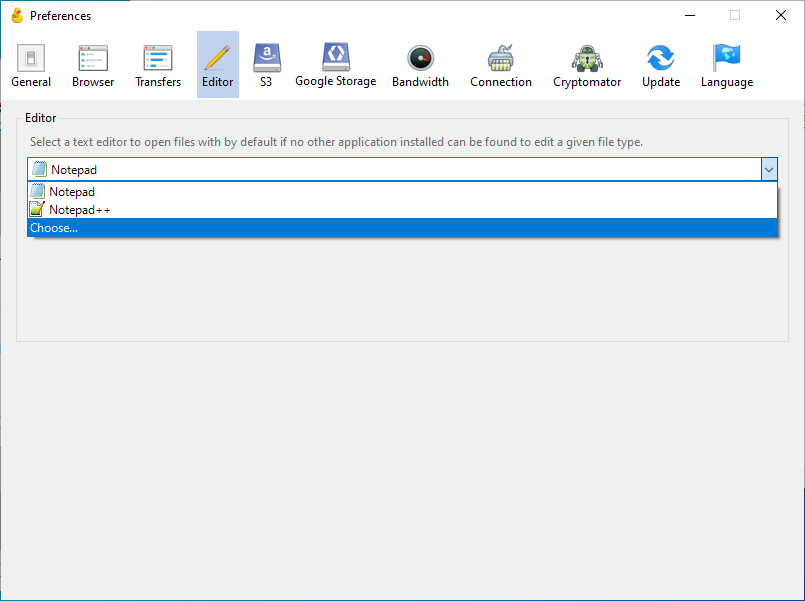
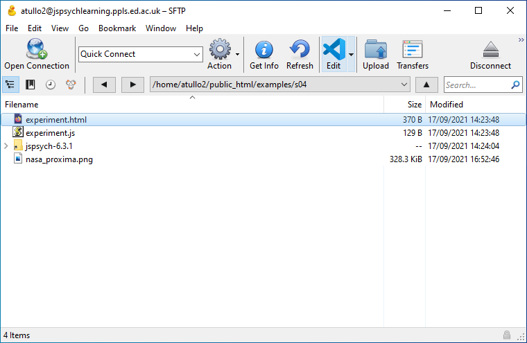
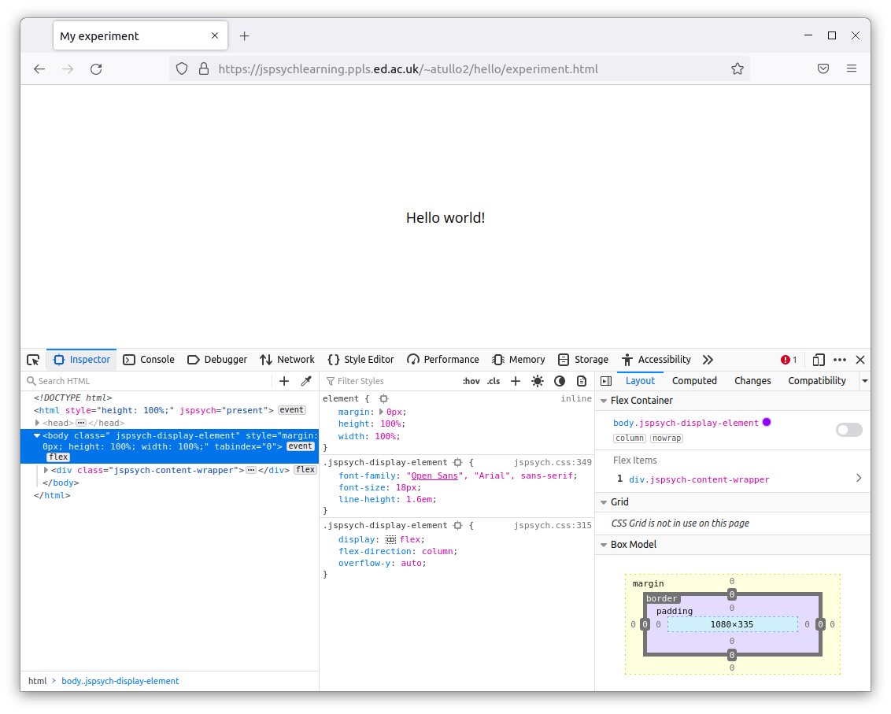
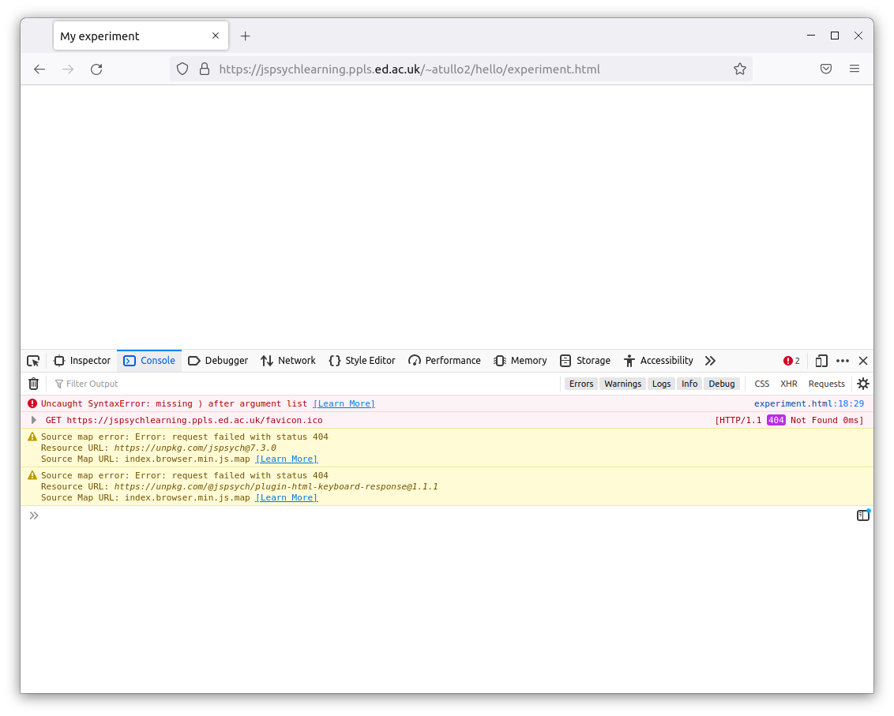
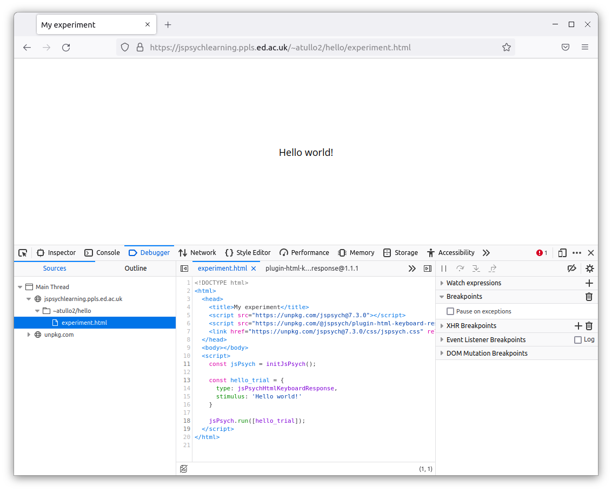
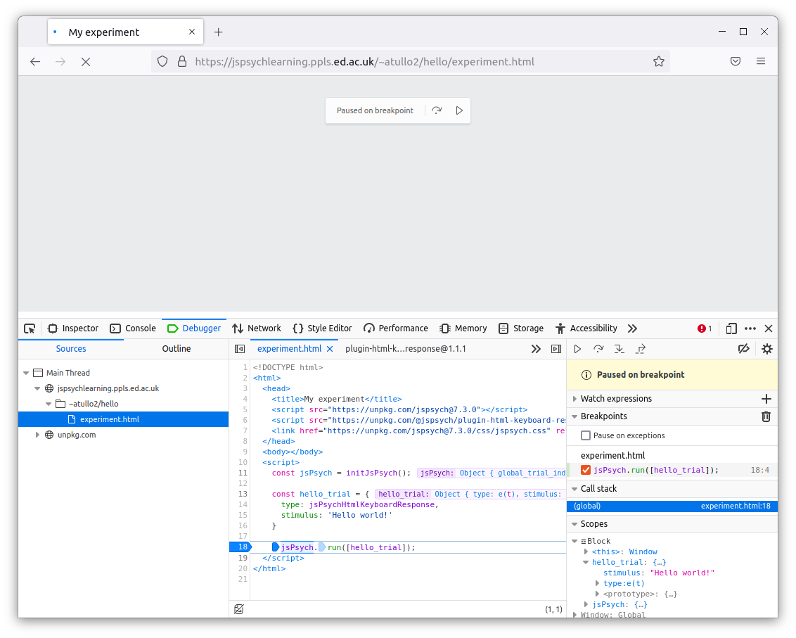
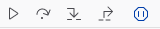

Developer tools and editing files
=================================

In this section we'll take a look at some practicalities
associated with web experiments in general, and CyberDuck
and our server in particular.

Editing files directly
----------------------

CyberDuck can allow you to edit files on the server directly.
What it actually does is download a copy, and open it in your editing program.
It then uploads the file automatically when it changes.

Open CyberDuck, and find the Preferences window with
Edit → Preferences on Windows or CyberDuck → Preferences on Mac.
Then click on "Editor" at the top. You should see this:

In the dropdown menu, choose your text editor. If you followed my suggestion at the
start, this will be Visual Studio Code. Check the box "Always use this application".

If your text editor is not there,
you'll need to select "Choose ...." and find it. You may find 
:ref:`this note on finding Visual Studio Code <editor_hunt>` useful. (You only
need to do this if it's not there -- if your chosen text editor
was in the list, you've finished).

Once this is set up (with whichever editor you use) you can edit a file
directly by selecting it and clicking on the "Edit" button in the toolbar.

.. _developer_tools:

Developer Tools
---------------

When writing a computer program, it's good to have
tools to help you find out what's going on. This is
particularly important when something goes wrong! For an
online experiment in JavaScript, you can use the
web developer tools in your browser. All recent versions of
browsers have these tools built in.

In most browsers you can open developer tools from the menu with More Tools → Developer Tools,
or by pressing Ctrl-Shift-I on Windows or Command-Option-I (⌘-⌥-I) on Mac.

Go to the page for your experiment -- use the link for the
uploaded copy on the server in your web browser, not the copy on your computer.

Now go to the web page for the example experiment
you created last week. Enable Developer Tools (see the list above) and
reload the page. You'll see something like this:

The console
...........

Click on the tab marked "Console". This contains messages from your web browser.
Most useful are the errors! Open your `experiment.html` file and break the code.

    Yes, I'm actually telling you to break the code! The easiest way is to delete
    a bracket -- ``(``, ``[`` or ``{``. If these are not in matching pairs that will cause an
    error.

Now reload the page. You should see something like this:

There's an error reported in the console, in red. This will give you a clue as
to where the problem is! You can click on the links on the right which will show
you the relevant parts of the code. While error messages can be a little cryptic,
there's usually something which will help, like "missing }". At the end of the line
with the error you'll see something like "experiment.html:18:29". This means that
the error was noticed on line 18, at the 29th character. Sometimes this is a little
bit after the actual error, but it usually gives you a good place to start looking.

Now fix your experiment and reload the page again -- the error should disappear!

The debugger
............

These tools can also allow you to step through the code line-by-line. Now click
on the tab marked "Debugger" or "Sources". You'll see something like this:

Here you can see your code, and watch it run. Click in the margin next to the code,
on the line:

.. code:: javascript

    jsPsych.run([hello_trial]);

Now reload the page. The program has stopped on that line. The point that you chose
by clicking in the margin is called a **breakpoint**.

On the right there's a sidebar called "Scopes" or "Scope". Here you'll be able to see what
value different variables have. Some of these are built in to the browser, or part of the
internal workings of jsPsych -- don't worry about these for now.

The important thing to note is that you can see the value for the node (in the tutorial,
this is called "hello_trial"). As you build up a more complex program there will be
many such variables, and their values can change as the program runs, so it's good
to know that you can inspect this as the program runs.

You can also continue running the program. These tools, or something like them, will be
near the code:

The first of these controls (the triangle or "play button")
lets the program continue running until it finishes, or until another breakpoint is reached.
The second steps through the code gradually, one line at a time.

That concludes the introduction to Developer Tools. Don't worry if you didn't understand
everything on the screen when it was running -- the important thing is to know that it's
there to help you when your program isn't working! **When your code isn't working, the first
thing you should try is opening Developer Tools to see if you have any error messages.**
