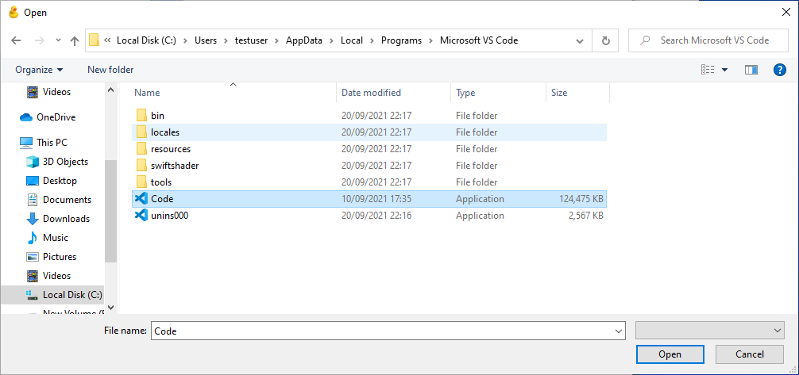

.. _editor_hunt:

Note on finding VS Code
=======================

Only follow this bit if you couldn't find Visual Studio in the drop-down menu!

Visual Studio Code can be quite difficult to find on
Windows as it's in a hidden folder. Go to "This PC", then "Users", then choose your username.

Here the username is the one that you see when you log in to your PC, *not* the
one on the server.

Then after the file location type "AppData", so it reads:

    C:\\Users\\<your username>\\AppData

The folder is there, but you won't be able to see or click on it unless you've
already told Windows to show you hidden files.

Now go into the "Local" folder and inside that "Programs" and "Microsoft VS Code":

    C:\\Users\\<your username>\\AppData\\Local\\Programs\\Microsoft VS Code

and choose the file called "Code":

